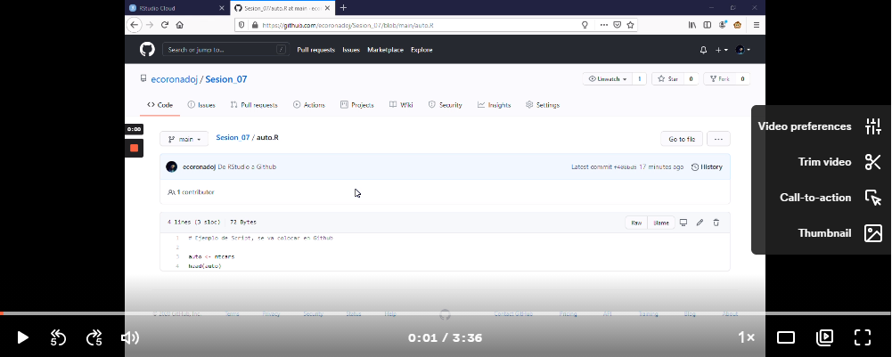

# Ejemplo 1. Conexión entre RStudio y Github

#### Objetivo
- Hacer uso de los recursos de la nube de RStudio y Github
- Utilizar como repositorio y control de cambios a Github
- Hacer el commit, push y pull

#### Requisitos
- Tener una cuenta de RStudio cloud
- Tener cuenta de Github

#### Desarrollo

Dentro de esta sesión podrás realizar una interacción entre RStudio y Github, haciendo posible trabajar con scripts en una interface de RStudio desde la nube, es decir, que se cargará en la ventada de tu explorador, con esto podrás trabajar de manera remota con scripts y poder alojarlos en algún repositorio.

- Para realizar el `commit` y `push`, es decir, mandar algún archivo(s), desde RStudio hacía Github, deberás seguir los pasos que se muestran en el siguiente video:

- En caso contrario, para hacer el `pull`, mandar archivos desde Github hacía RStudio se hará de la siguiente manera:

