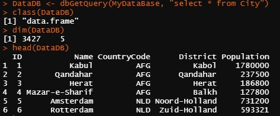

# Ejemplo 2. Conexión a una BDD con `R`


#### Objetivos
- Conectarse a una BDD utilizando `R`
- Lectura de  una BDD en `R`

#### Requisitos

- Tener instalados `R` y Rstudio
- Haber estudiado el Prework

#### Desarrollo

CONFIGURACIONES DE CONEXIÓN: Hay 5 configuraciones necesarias para hacer una conexión:

- Driver : consulta la sección previa de controladores para obtener información sobre la configuración, se utilizarán los drivers de MySQL
- Server : una ruta de red al servidor de la base de datos 
- UID : nombre de usuario utilizado para acceder al servidor MySQL 
- PWD : la contraseña correspondiente al UID proporcionado 
- Port : debe establecerse en 3306 generalmente

Comenzaremos instalando las librerías necesarias para realizar la conexión y lectura de la base de datos en RStudio, si previamente los tenías instalados omite la instalación, recuerda que solo necesitas realizarla una vez. 
```R
install.packages("DBI")
install.packages("RMySQL")

library(DBI)
library(RMySQL)
```

Una vez que se tengan las librerías necesarias se procede a la lectura (podría ser que necesites otras, si te las solicita instalalas y cargalas) de la base de datos de Shiny, la cual es un demo y nos permite interactuar con este tipo de objetos. El comando `dbConnect` es el indicado para realizar la lectura, los demás parámetros son los que nos dan acceso a la BDD.

```R
MyDataBase <- dbConnect(
  drv = RMySQL::MySQL(),
  dbname = "shinydemo",
  host = "shiny-demo.csa7qlmguqrf.us-east-1.rds.amazonaws.com",
  username = "guest",
  password = "guest")
```

Si no se arrojaron errores por parte de R, vamos a explorar la BDD

```R
dbListTables(MyDataBase)
```


Ahora si se quieren desplegar los campos o variables que contiene la tabla `City` se hará lo siguiente 
```R
dbListFields(MyDataBase, 'City')
```

Para realizar una consulta tipo MySQL sobre la tabla seleccionada haremos lo siguiente 
```R
DataDB <- dbGetQuery(MyDataBase, "select * from City")
```

Observemos que el objeto `DataDB` es un data frame, por lo tanto ya es un objeto de R y podemos aplicar los comandos usuales

```R
class(DataDB)
dim(DataDB)
head(DataDB)
```




```R
pop.mean <- mean(DataDB$Population)  # Media a la variable de población
pop.mean 

pop.3 <- pop.mean *3   # Operaciones aritméticas
pop.3
```

Incluso podemos hacer uso de otros comandos de búsqueda aplicando la librería `dplyr` 

```R
library(dplyr)
pop50.mex <-  DataDB %>% filter(CountryCode == "MEX" ,  Population > 50000)   # Ciudades del país de México con más de 50,000 habitantes

head(pop50.mex)

unique(DataDB$CountryCode)   # Países que contiene la BDD
```
