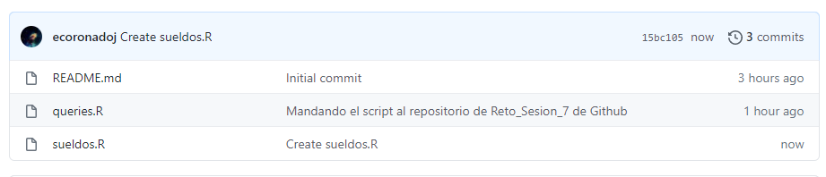
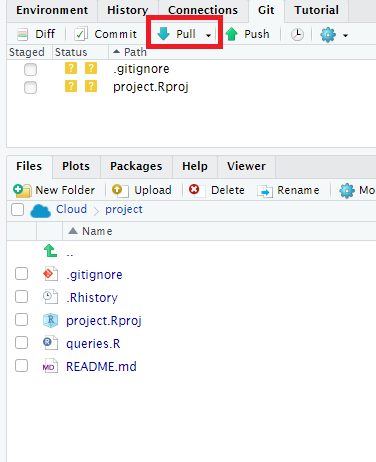

## Subiendo el archivo sueldos.R en Github

## Pegando el código

## Verificando que se creo

### Realizando el pull en RStudio

## Verificando que se realizó correctamente la carga del archivo el RStudio

