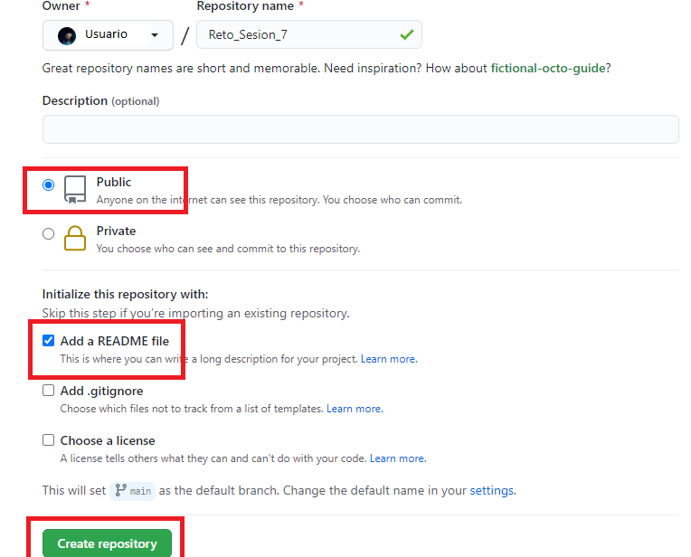
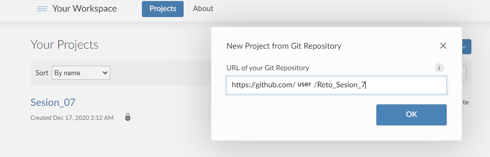
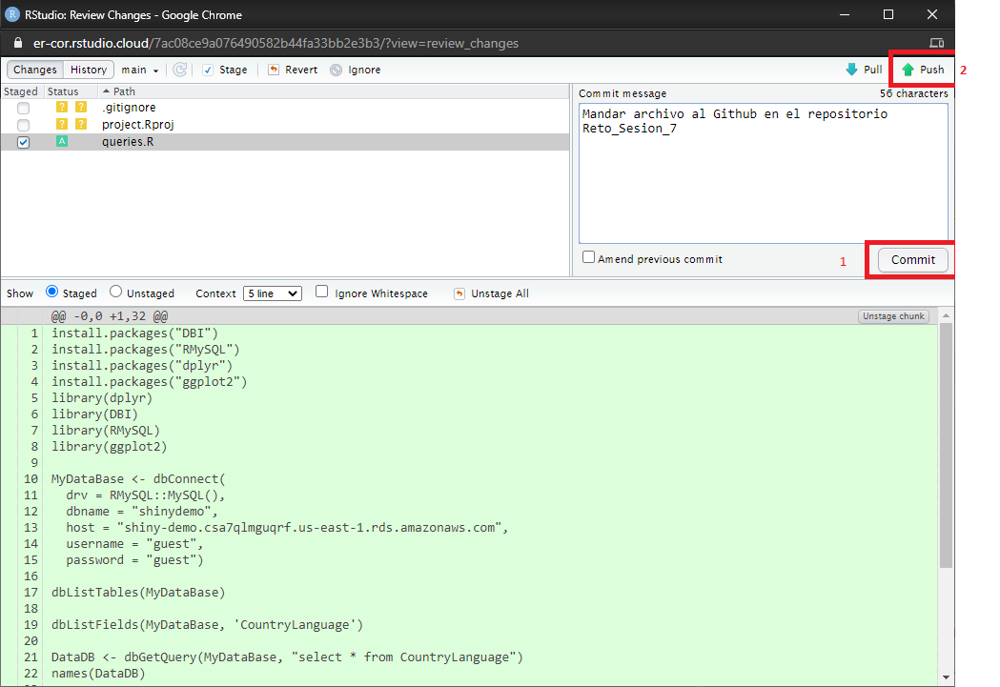
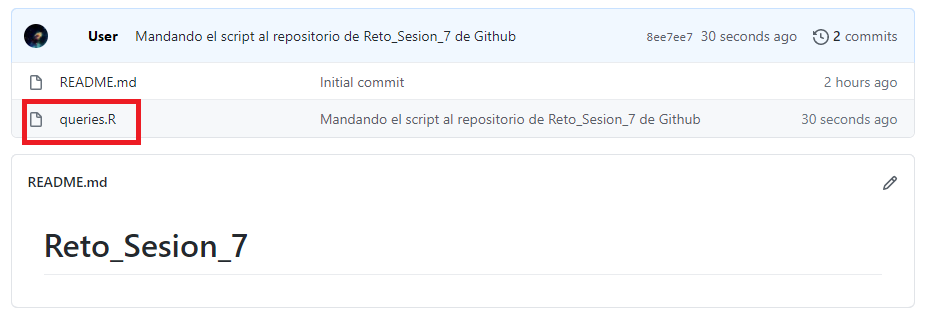

## Crear el repositorio en Github



## Vincularlo en RStudio



## Realizar el commit y push



## Comprobación del push en Github



## Código del reto 

```R
install.packages("DBI")
install.packages("RMySQL")
install.packages("dplyr")
install.packages("ggplot2")
library(dplyr)
library(DBI)
library(RMySQL)
library(ggplot2)

MyDataBase <- dbConnect(
  drv = RMySQL::MySQL(),
  dbname = "shinydemo",
  host = "shiny-demo.csa7qlmguqrf.us-east-1.rds.amazonaws.com",
  username = "guest",
  password = "guest")

dbListTables(MyDataBase)

dbListFields(MyDataBase, 'CountryLanguage')

DataDB <- dbGetQuery(MyDataBase, "select * from CountryLanguage")
names(DataDB)

SP <- DataDB %>% filter(Language == "Spanish")
SP.df <- as.data.frame(SP) 


SP.df %>% ggplot(aes( x = CountryCode, y=Percentage, fill = IsOfficial )) + 
  geom_bin2d() +
  coord_flip()
  ```
