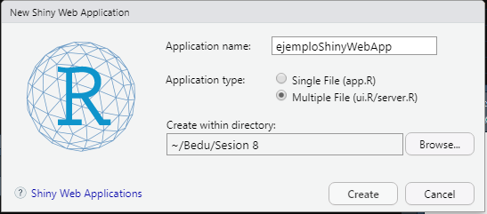
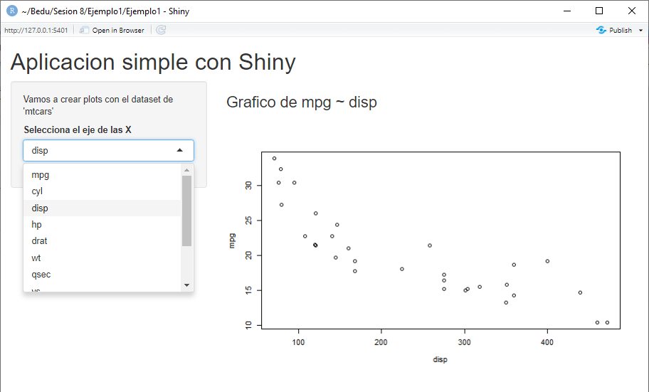

# Ejemplo 01. Ambiente de trabajo UI y Server

#### Objetivo

- Crear un dashboard simple para mostrar gráficas de dispersión en una webApp
- Entender el entorno de trabajo con la librería `Shiny`
- Funciones básicas de la UI y del Server

#### Requisitos
- Tener instalada y cargada la librería `Shiny`
- Desarrollar y entender el prework
- Conocimiento de funciones como `paste` y `plot` 

#### Desarollo

Durante esta sesión serás capaz de realizar una webApp con el uso de la librería de `Shiny`, esta es útil para presentar reportes con los resultados destacados de nuestra investigación. Existen dos formas para realizar webApp, comenzaremos con dos archivos separados para tener un mayor orden:

Lo primero que se debe hacer es generar un archivo Shiny Web App en RStudio


Hay que colocar un nombre a nuestra Web App, además de seleccionar _Multiple File_ (esto creará dos archivos ui.R y server.R) y la ruta donde se almacenará 




Una vez hecho esto, tendremos los dos archivos creados, en el UI (User interface), se establece la visualización de nuestro Dashboard o reporte, y en el Server se establecen las variables de entrada y salida. Para ejecutar la Web App con dar clic en `Run App` bastará. Los archivos por default tienen un ejemplo precargado, este podría servir como base para ajustarlo a las necesidades de cada usuario


En la siguiente imagen podemos apreciar el ejemplo indicado anteriormente, ejecuta el ejemplo, intenta mover los parámetros para que observes el resultado, tanto dentro del archivo ui.R como en la webApp.

<p align="center">
 
</p>

A continuación se creará una webApp desde cero, se deben borrar todos los comentarios para dejar solamente las siguientes líneas de código en el archivo `ui.R`

```R
library(shiny)
shinyUI(

)
```


Ahora en `ui.R`, dentro de la función `shinyUI` colocaremos las siguientes instrucciones para poder visualizar las partes de nuestra webApp, posteriormente ejecuta el código para que observes el resultado y puedas ubicar donde se localiza gráficamente cada sentencia

```R
library(shiny)
shinyUI(
    pageWithSidebar(
    
        headerPanel("Este es el header panel"),
        sidebarPanel("Este es el sidebar panel"),
        mainPanel("Este es el main panel")
    
    )
)
```


Con lo anterior ya pudiste observar la distribución de los objetos dentro de la webApp. Ahora vamos a crear una webApp; una donde se puedan observar algunas gráficas de dispersión para las variables del dataset `mtcars`. 

En el archivo **`ui.R`** realiza los siguientes cambios

```R
library(shiny)
shinyUI(
    
    pageWithSidebar(
        headerPanel ("Aplicacion simple con Shiny"),
        sidebarPanel (
            p("Vamos a crear plots con el dataset de 'mtcars'"),
            selectInput("x", "Selecciona el eje de las X",      # Se indica que la variable "x" será la de entrada
                        choices = colnames(mtcars) )            # Sirve para desplegar las variables a graficar en este caso son todas las de mtcars
                    ),
        mainPanel (h3(textOutput("output_text")), 
                   plotOutput("output_plot")
                   )
                  )
        )
```
 
Ahora en el archivo **`server.R`**, debes borrar todos los comentarios, de tal modo que quede de la siguiente forma, el código siguiente define los argumentos de `input` y `output` que se visualizarán en la *UI*, ahora se harán los gráficos correlación entre `mpg` y el resto de variables de `mtcars`. (Con _renderText_ y _renderPlot_ se "renderizará" el texto y la gráfica respectivamente)

```R
library(shiny)

shinyServer(function(input, output) { 
    output$output_text <- renderText(paste("Grafico de mpg ~ ", input$x))   # input$x es la selección que se hizo en la UI
    output$output_plot <- renderPlot(plot(as.formula(paste("mpg~", input$x)), 
                                          data = mtcars))
                                    }
            )
```

Tu resultado debería ser como la siguiente imagen
<p align="center">
 
</p>

Ejecuta la webApp y observa el resultado que se generó con el código, ¿Qué otros escenarios se te ocurren?
